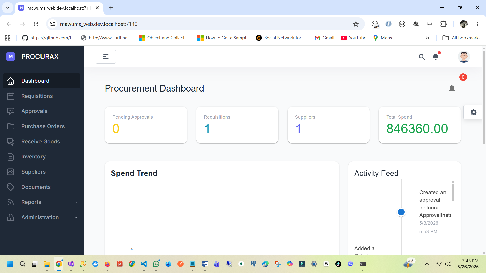
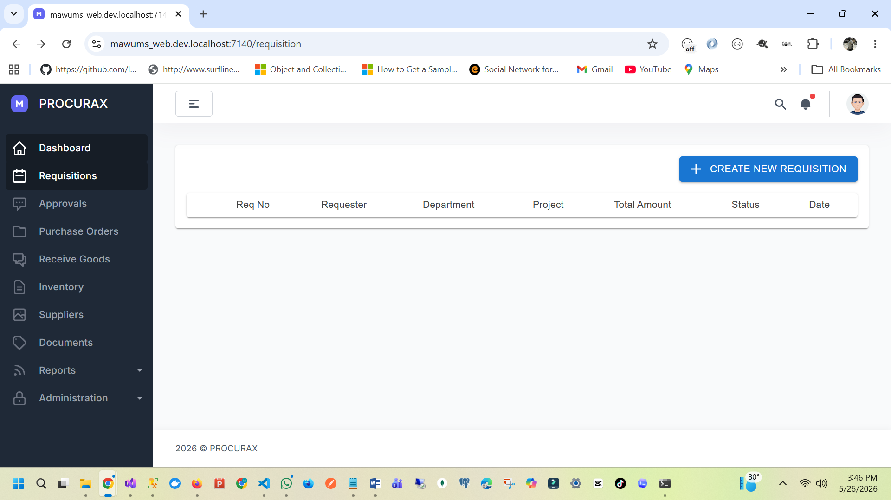
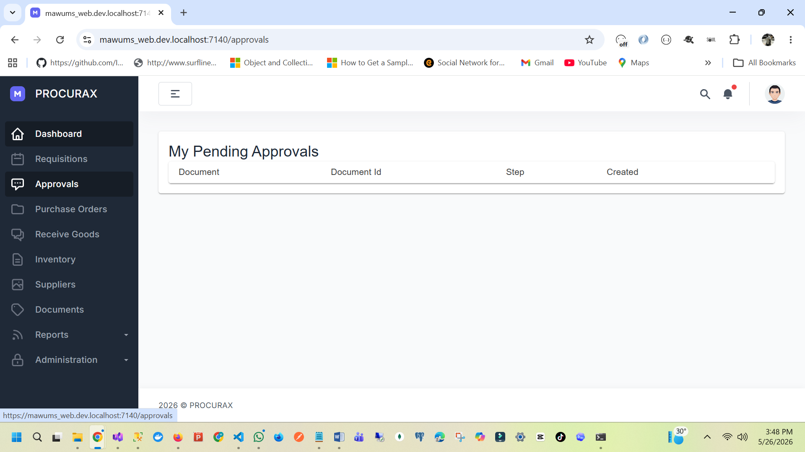
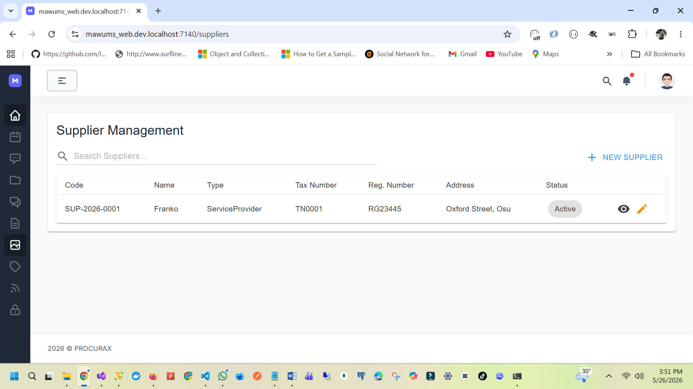

# MAWUMS / ProcuraX

### Enterprise Procurement & Workflow Intelligence Platform

A secure, enterprise-grade procurement, approval, and compliance workflow system designed to digitize and govern end-to-end purchasing processes across organizations, ministries, and large enterprises.

ProcuraX transforms fragmented, manual procurement operations (email, spreadsheets, paper approvals) into a **fully auditable, role-driven digital workflow ecosystem**.

---

# Executive Summary (Investor View)

MAWUMS / ProcuraX is a **workflow automation and procurement governance platform** that enforces structured approval hierarchies, budget controls, and vendor accountability.

It is designed for:

- Government procurement systems (GovTech)
- Large enterprises with strict audit requirements
- Financially controlled procurement environments
- Multi-department organizations with layered approvals

---

# Core Problem It Solves

Traditional procurement systems suffer from:

- Manual approval delays
- Lack of transparency
- Budget overruns without enforcement
- Poor vendor traceability
- Weak audit trails
- Fragmented communication across departments

---

### ProcuraX solves this by introducing:

- Structured digital approval workflows
- Enforced budget validation before approval
- End-to-end procurement traceability
- Centralized vendor and contract management
- Immutable audit logging

---

# Core Modules

## 1. Requisition Management

- Create and submit purchase requisitions
- Attach supporting documents
- Track request lifecycle in real-time
- Department-based categorization

---

## 2. Workflow & Approval Engine

A dynamic rule-based workflow system.

- Multi-level approval chains
- Role-based routing (RBAC)
- Conditional approval logic
- Escalation rules for delays
- Approval history tracking


### Supported Devices:

- Teltonika GPS devices
- Wialon-compatible devices
- Traccar-supported hardware ecosystem

---

## 3. Vendor Management

- Vendor onboarding and profiling
- Vendor classification and rating
- Contract attachment and lifecycle tracking
- Performance history tracking (future-ready)

---

## 4. Purchase Order Management

- Convert approved requisitions into purchase orders
- Track PO lifecycle from creation to completion
- Vendor assignment and fulfillment tracking

---

## 5. Budget Control & Validation

- Department-level budget allocation
- Real-time spend validation
- Pre-approval budget enforcement
- Overspending prevention rules

---

## 6. Audit & Compliance Engine

- Full system audit logging
- Immutable approval history
- Traceable procurement lifecycle
- Compliance reporting for internal/external audits

---

## 7. Identity & Access Control (RBAC)

- Role-based system access
- Permission-based feature restrictions
- Secure workflow separation between departments

---

# System Architecture

ProcuraX follows enterprise-grade architectural principles:

- Clean Architecture (Domain / Application / Infrastructure / UI separation)
- CQRS (Command Query Responsibility Segregation)
- Workflow-driven domain design
- Event-based state transitions
- Strong separation of concerns

---

# Technology Stack

| Layer        | Technology                |
| ------------ | ------------------------- |
| Frontend     | Blazor Server             |
| Backend      | ASP.NET Core Web API      |
| Database     | SQL Server                |
| ORM          | Entity Framework Core     |
| Auth         | Duende IdentityServer     |
| Real-time    | SignalR                   |
| Deployment   | Azure / Docker            |
| Architecture | Clean Architecture + CQRS |

---

# End-to-End Procurement Flow

```text
Requisition Created
        ↓
Workflow Engine Evaluates Rules
        ↓
Budget Validation Check
        ↓
Multi-Level Approval Process
        ↓
Purchase Order Generation
        ↓
Vendor Fulfillment
        ↓
Audit Logging & Reporting
```
---

# System Screenshots

## Dashboard Overview



---

## Requisition Management



---

## Approval Workflow Engine



---

## Vendor Management



---

## Purchase Orders


---

## Audit Logs & Compliance


---

# Key Differentiators

### Workflow Engine (Core Strength)

Not just CRUD approvals — a **rule-driven workflow system** with dynamic routing.

### Budget Enforcement Layer

Prevents financial approval bypass and uncontrolled spending.

### Audit-First Design

Every action is logged, traceable, and compliance-ready.

### Enterprise Security Model

RBAC + IdentityServer integration for strict access control.

---

# Roadmap

### Completed

- Requisition Management
- Approval Workflow Engine
- Vendor Management
- Purchase Orders
- Audit Logging
- RBAC Security Model

### In Progress / Future

- Budget forecasting engine
- AI procurement recommendations
- ERP integrations (SAP / Oracle)
- Mobile approval application
- Advanced analytics dashboard

---

# Security Model

- Role-Based Access Control (RBAC)
- IdentityServer authentication layer
- Audit trail immutability
- Workflow-level permission enforcement
- Secure API boundaries

---

# Business & Market Positioning

ProcuraX sits in the intersection of:

- GovTech modernization
- Enterprise workflow automation
- Financial control systems
- ERP augmentation layer (not replacement)

---

### Ideal Customers:

- Government ministries
- Universities & public institutions
- Large enterprises
- Financial institutions
- NGOs with procurement governance needs

---

# Author

**Somad Yessoufou**
Senior Software Engineer specializing in:

- Enterprise .NET systems
- Workflow & approval engines
- Microservices architecture
- Real-time distributed systems
- GovTech & logistics platforms

---

# Portfolio Context

This project is part of a broader enterprise systems portfolio including:

- **Haulix** – Fleet Operations & Logistics Intelligence Platform
- **ProcuraX / MAWUMS** – Procurement & Workflow Governance System

Together, these systems demonstrate expertise in:

- Enterprise architecture design
- Workflow automation systems
- Real-time distributed systems
- SaaS-grade backend engineering

---

# License

This project is a portfolio and demonstration system.

Commercial use, redistribution, or replication without permission is prohibited.

For licensing or enterprise deployment inquiries, contact the author.

---

# Support

If you find this project valuable:

- Star the repository
- Watch for updates
- Connect for collaboration opportunities